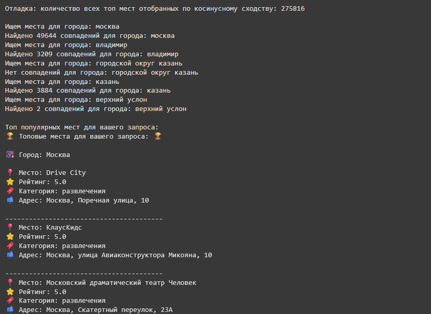
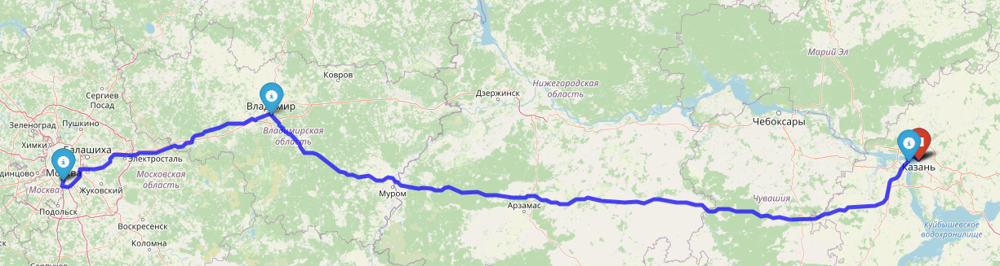

# Умный гид для путешественников и автотуристов

Данный гид позволяет получить информацию о местах интереса и достопримечательностях по пути следования при автомобильных путешествиях.

В основу решения лежит возможность построения маршрута путешествия, позволяющего пользователю включить в собственный маршрут поездки интересующие его достопримечательности и места интереса (подборка мест осуществляется с учётом средневзвешенных оценок других пользователей)

### 1. Установка и запуск

Установка и запуск решения осущетсвляется с помощью сервиса [Google Colaboratory](https://colab.research.google.com/)

Порядок выполнения этапов:

1. Установка зависимостей и настройка импорта
2. Загрузка и обработка данных из Yandex Geo Reviews Dataset
3. Подготовка и настройка данных для нейросети
4. Обучение модели
5. Определение городов и построение маршрутов 
6. Генерация рекомендаций на основе модели
7. Предоставление тестовых данных (пункты отправления/назначения) и вывод получившихся результатов

Более подробная информация представлена в комментариях исполняемого ipynb-файла 

### 2. Пример вывода 

На примере вводных данных:
start_address = "Москва, Россия"
end_address = "Казань, Россия"

### 3. Команда проекта
* Никита Муравьёв 
* Никита Кузнецов
* Асия Бурганова 
* Сергей Сухарников 

